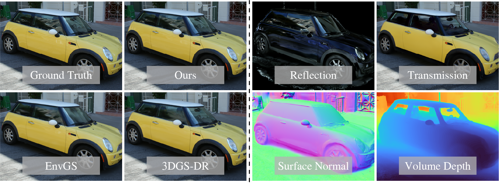

## N3DV / Ex4DGS에 RT-Splatting 이식

N3DV `coffee_martini`의 같은 시점 이미지로 학습한 Ex4DGS에 RT-Splatting의 반사·투과 표현을 이식합니다. **기존 가우시안 하나의 집합을 공유**하며, 별도 유리 평면이나 임의 깊이는 추가하지 않습니다. 공식 RT 코드의 기준 커밋은 `3f45b3cac4be04db9f3092234666b695991b268a`, Ex4DGS는 `7fac64997164fde64732c80261e56adf66ca14df`입니다.

공식 RT의 점유도/광학적 불투명도 분리, 2D 표면 렌더러, SphMip 조명 인코딩, MLP, 반사·투과·산란 합성, 반사에 따른 투과 gradient 제어, 법선·점유도·consistency 손실을 사용합니다. **consistency는 공식 코드의 합산을 유지**합니다. 복사한 도우미의 출처와 해시는 [`provenance.json`](Ex4DGS/rt_port/vendor/provenance.json)에 있습니다.

Ex4DGS의 3D 가우시안과 학습된 상태를 유지하기 위해 투과는 Ex4DGS 3D 렌더러로, 표면은 같은 가우시안의 위치·회전·크기를 이용한 공식 RT 2D 렌더러로 계산합니다. 처음에 가장 짧은 축을 표면 법선 축으로 선택하고 위치·회전은 계속 학습합니다. 이는 공식 RT의 모든 패스를 2D로 렌더링하는 방식과 다르므로 **논문 그대로의 재현이라고 부르지 않습니다**. 두 분기는 추가 학습 중 가우시안 수를 고정합니다. 현재 실행기는 frame 0을 검증하며, 전체 동영상의 4D 성능은 아직 검증하지 않았습니다.

학습은 다음 순서입니다.

1. 완료한 Ex4DGS 체크포인트에서 지속적인 고오차 학습 영역을 고정합니다. 현재는 26k–30k의 다섯 관측을 사용합니다.
2. 동일 체크포인트와 원래 optimizer 상태에서 기본 Ex4DGS와 RT 이식 모델을 각각 5,000회 추가 학습합니다. 카메라 순서·랜덤 배경·학습 횟수는 같습니다. 실행 시간과 파라미터 수까지 같지는 않습니다.
3. 후보에는 투명 영역이라는 임시 감독을 적용하고, 후보 밖은 미확인으로 둡니다. 후보의 BCE만 평균하며 원본의 후보 밖 불투명/투과율 감독은 제외합니다. 전체 영상의 RGB 손실은 유지합니다. RT는 장면 전체에 표현되며 후보가 픽셀별 켜기/끄기 스위치는 아닙니다.
4. cam00·cam09의 학습 전 고오차 검증 영역을 고정하고 1,000회마다 두 모델을 평가합니다. 검증 영역은 학습에 사용하지 않습니다. 카메라마다 정의한 영역이 동일한 실제 유리라는 가정도 하지 않습니다.
5. 마지막 3회 중 2회 이상 **및 마지막 평가**가 통과하면 RT 모델을 선택합니다. 기본 조건은 후보의 합산 MSE 기준 PSNR +0.5dB, 각 검증 카메라 후보 악화 없음, 전체 평균 PSNR 악화 없음, 후보 밖 MSE 증가 2% 이하입니다. 실패하면 추가 학습한 Ex4DGS를 선택합니다. 영역별 지표를 남기지만 최종 결과는 모델 전체를 선택하며 이미지 조각을 합치지 않습니다.
6. 선택을 저장한 다음 cam19를 test합니다. 과거 기본 학습 프리뷰에 cam19가 노출되었으므로 완전히 미노출인 test는 아닙니다.

후보는 유리 정답이 아닙니다. PSNR 개선 여부는 이 표현이 유용했는지 판단하는 기준이며 유리 존재를 확정하지 않습니다. 공식 consistency는 한 영상의 여러 후보를 함께 묶습니다. RT 단계의 iteration은 추가 학습 1회부터 세므로, 원본 기본값인 LPIPS 시작 15,000회는 이번 5,000회 실험에서 활성화되지 않습니다. 광학적 불투명도와 투과율 초기값은 원본의 0.5입니다. 원본과의 차이와 제약은 [`EXPERIMENT.json`](Ex4DGS/EXPERIMENT.json)에 기록합니다.

주요 코드:

| 역할 | 파일 |
| --- | --- |
| 두 분기 추가 학습·저장·재개 | [`run_rt_ex4dgs.py`](Ex4DGS/run_rt_ex4dgs.py) |
| 재질·SphMip·MLP | [`rt_port/model.py`](Ex4DGS/rt_port/model.py) |
| 반사·투과 렌더링 | [`rt_port/renderer.py`](Ex4DGS/rt_port/renderer.py) |
| 공식 손실과 후보만 감독 | [`rt_port/losses.py`](Ex4DGS/rt_port/losses.py) |
| 고정 평가 영역·모델 선택 | [`evaluation.py`](Ex4DGS/rt_port/evaluation.py), [`selection.py`](Ex4DGS/rt_port/selection.py) |
| 선택된 모델 다시 렌더링 | [`render_rt_selected.py`](Ex4DGS/render_rt_selected.py) |
| 실험 설정 | [`coffee_rt_port.json`](Ex4DGS/configs/coffee_rt_port.json) |

기존 Ex4DGS 환경에서 공식 RT 확장을 같은 Torch 버전으로 빌드합니다. 저장소 루트의 공식 RT CUDA 소스를 사용합니다.

```bash
cd Ex4DGS
pip install 'matplotlib<3.10'
pip install --no-build-isolation ../submodules/diff-surfel-anych
pip install --no-build-isolation git+https://github.com/NVlabs/nvdiffrast.git@253ac4fcea7de5f396371124af597e6cc957bfae
python run_rt_ex4dgs.py \
  --baseline-run /path/to/completed_baseline \
  --source /path/to/coffee_martini_f000 \
  --config configs/coffee_rt_port.json \
  --output /path/to/new_rt_port_trial
```

중단 후 재개할 때는 같은 명령에 `--resume`을 추가합니다. `latest.pth`에 두 모델·optimizer·RT 조명/재질·난수 상태·샘플링 순서를 저장합니다. `selected.pth`는 원래 baseline 파일 없이도 렌더링할 수 있습니다.

검증 기록: [67개 CPU 테스트와 실제 해상도 GPU 통합 검사](records/rt_port_validation_20261002.json), [두 모델의 저장·재로딩 검사](records/rt_port_reload_20261002.json), [중단·재개 검사](records/rt_port_resume_20261002.json). CUDA 비결정성으로 일부 파라미터의 엄격한 수치 일치는 통과하지 않았으며 해당 차이를 숨기지 않고 기록했습니다. RNG·샘플 순서·optimizer 횟수는 정확히 같고, 재개 후 영상 MSE는 미리 정한 오차 범위 안에서 일치했습니다. 이 검사는 최종 성능 개선의 증거가 아닙니다.

```bash
python render_rt_selected.py --checkpoint /path/to/trial/selected.pth \
  --source /path/to/coffee_martini_f000 --output /path/to/new_preview
python -m pytest tests/test_rt_port_losses.py tests/test_rt_port_selection.py tests/test_rt_port_evaluation.py -q
python tools/smoke_rt_port.py
```

데이터, 이미지, 체크포인트와 대용량 출력은 Git에서 제외합니다. `deployment/`는 현재 서버의 `/workspace` 경로를 사용하는 실행 도구이므로 다른 서버에서는 경로를 맞춰야 합니다. 이전 별도 평면 실험인 `run_surface_hypotheses.py`와 관련 스크립트는 기록용으로 남아 있으며 현재 coffee 설정은 새 RT 이식 실행기를 사용합니다. 아래는 보존한 공식 RT-Splatting 설명입니다.

---

<div align="center">

# RT-Splatting: Joint Reflection-Transmission Modeling with Gaussian Splatting

[**Ji Shi**](https://github.com/sjj118) · [**Xianghua Ying**](https://scholar.google.com/citations?hl=zh-CN&user=27o9L1wAAAAJ) · [**Bowei Xing**](https://dblp.org/pid/320/5822.html)
<br>
[**Ruohao Guo**](https://ruohaoguo.github.io/) · [**Wenzhen Yue**](https://scholar.google.com/citations?hl=zh-CN&user=UPxl-gMAAAAJ)
<br>

CVPR 2026 (Highlight)
<br>

[](https://arxiv.org/pdf/2605.18263)
[](https://sjj118.github.io/RT-Splatting)
[](https://drive.google.com/drive/folders/1mmKcm1Fb5djX3B_PDKfC7XyfQ38_p5nl)
</div>

 
RT-Splatting is a hybrid surface-volume rendering framework that jointly models high-fidelity reflections and clear transmissions for semi-transparent scenes. It overcomes the blurry reflections and occluded backgrounds of existing methods, delivering state-of-the-art, real-time view synthesis. Beyond rendering, it perfectly decomposes the scene into independent reflection and transmission layers, unlocking powerful and intuitive material editing capabilities.

## Installation

```shell
conda create -n rtsplat python=3.10 -y
conda activate rtsplat
pip install -r requirements.txt

pip install --no-build-isolation submodules/simple-knn
pip install --no-build-isolation submodules/diff-surfel-anych

pip install --no-build-isolation git+https://github.com/NVlabs/nvdiffrast
```

## Datasets

We evaluate our method primarily on [Ref-Real](https://storage.googleapis.com/gresearch/refraw360/ref_real.zip), [NeRF-Casting](https://dorverbin.github.io/nerf-casting/), [EnvGS](https://drive.google.com/file/d/1FMtj2YvdbaQe8vxwZlULcSBuTWb4pI7I), [Tanks&Temples](https://repo-sam.inria.fr/fungraph/3d-gaussian-splatting/datasets/input/tandt_db.zip) and our self-captured scenes. Transparent masks and our self-captured scenes are available on [Google Drive](https://drive.google.com/drive/folders/1mmKcm1Fb5djX3B_PDKfC7XyfQ38_p5nl).

Put them under the `data` folder:

```
data/
├── rt-splatting/
│   ├── van/
│   │   ├── images/
│   │   ├── sparse/
│   │   └── transparent_masks/
│   └── swab/
├── nerf-casting/
├── ...
```

## Training & Evaluation

```shell
sh eval.sh
```

## Acknowledgements

This work is built on a number of inspiring research works:

- [2DGS: 2D Gaussian Splatting for Geometrically Accurate Radiance Fields](https://surfsplatting.github.io/)
- [Ref-GS : Directional Factorization for 2D Gaussian Splatting](https://ref-gs.github.io/)
- [EnvGS: Modeling View-Dependent Appearance with Environment Gaussian](https://zju3dv.github.io/envgs/)
- [NeRF-Casting: Improved View-Dependent Appearance with Consistent Reflections](https://dorverbin.github.io/nerf-casting/)
- [Ref-NeRF: Structured View-Dependent Appearance for Neural Radiance Fields](https://dorverbin.github.io/refnerf/)
- [SAM 2: Segment Anything in Images and Videos](https://ai.meta.com/sam2)

## Citation

If you find our work useful in your research, please cite:

```bibtex
@inproceedings{RT-Splatting,
  title={{RT-Splatting}: Joint Reflection-Transmission Modeling with Gaussian Splatting},
  author={Shi, Ji and Ying, Xianghua and Xing, Bowei and Guo, Ruohao and Yue, Wenzhen},
  booktitle={CVPR},
  year={2026},
}
```
