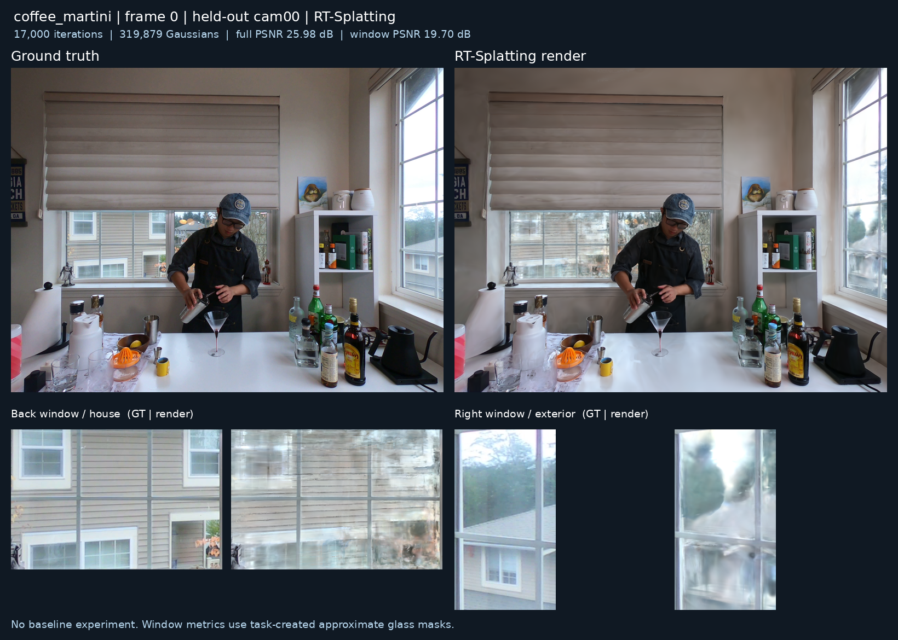

# coffee_martini · frame 0

RT-Splatting 단독 실행 · 학습 카메라 17개 · 확인용 cam00 · 해상도 1352 × 1014.

최신 공개 결과: **17,000회**. **학습 중간 결과이며, 최종 목표는 30,000회입니다.**

| Iteration | 전체 PSNR ↑ | 창문 PSNR ↑ | 전체 SSIM ↑ | LPIPS ↓ | 상세 결과 |
|---:|---:|---:|---:|---:|---|
| 15,000 | 26.043 | 19.763 | 0.8866 | 0.1836 | [이미지](step_015000/report/visual_summary.png) · [지표](step_015000/evaluation/metrics.json) |
| 16,000 | 25.874 | 19.660 | 0.8846 | 0.1769 | [이미지](step_016000/report/visual_summary.png) · [지표](step_016000/evaluation/metrics.json) |
| 17,000 | 25.982 | 19.702 | 0.8860 | 0.1753 | [이미지](step_017000/report/visual_summary.png) · [지표](step_017000/evaluation/metrics.json) |

브라우저에서 슬라이더를 쓰려면 저장소를 내려받고 `index.html` 또는 각 단계의 `report/index.html`을 여세요.

창문 마스크는 이번 실행에서 만든 근사 주석입니다. GT에는 실제 반사가 포함됩니다. 별도 모델과의 비교 실험은 수행하지 않았으며, 현재 수치만으로 원본 방법 대비 개선을 주장하지 않습니다.

모델과 렌더러는 원본을 사용하지만, 데이터 준비·학습 루프·일부 손실 계산을 변경했습니다. 자세한 설정은 루트의 `RUN_COFFEE.md`와 각 단계의 `config.json`을 참고하세요.

대용량 모델 체크포인트, 원본 영상, float 렌더링 배열은 이 Git 결과 묶음에 포함하지 않습니다.
